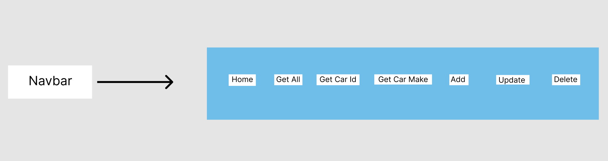

# Lab 4 / Lab 5 🚗 🚙
Lab 4 and Lab 5 is a fullstack CRUD app that utilizes a frontend and backend to create, read, update, delete the entries in the cars database.

# How to Start The App
First, cd into the backend folder and execute 'npm run devStart' to get the backend up and running. This will also make connection with sqlite database, create the table, and populate it.
Then, cd into the lab4-app folder and execute 'npm run start' to start the react app.
Now that both the frontend and backend are running, you can use the app.

# Access the backend
Visit http://localhost:3000/api to access the backend.

# API Endpoints
These methods are performed in server.js.
## GET:
### /api/cars/all
This will get all the cars in the database.
### /api/cars/id/:car_id
This will get a car in the database where the car id matches the parameter. Car id is required and must be a number.
### /api/cars/make/:make
This will get all cars in the database where the car make matches the parameter. Make is required, is case sensitive, and must start with a capital letter.

## POST:
### /api/cars/new
Make a new data insertion into the database with JSON data. It will parse the request body and insert into the database.

## PATCH:
### /api/cars/update/:car_id
Update an existing record in the database. Access it by matching car id parameter. 

## DELETE:
### /api/cars/delete/:car_id
Delete an existing record in the database. Access it by matching car id parameter. 

